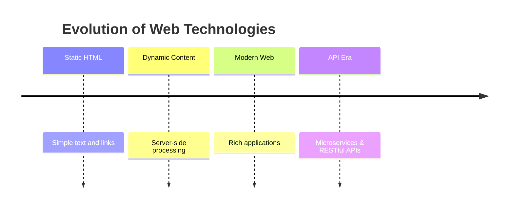
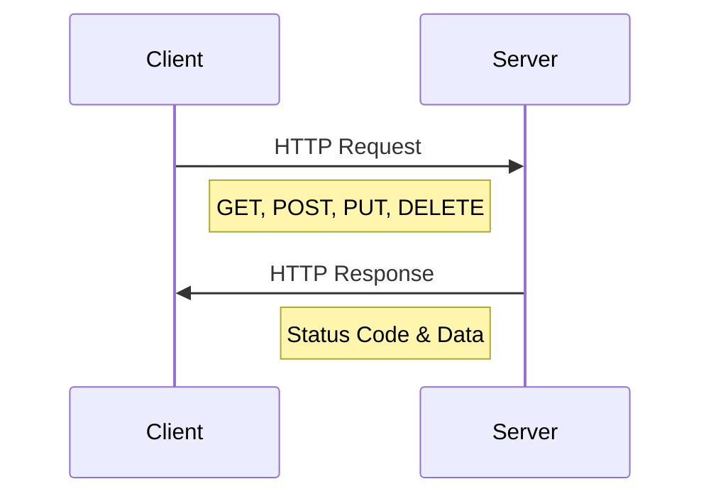

# HTTP (Hypertext Transfer Protocol)

## Overview
HTTP is a foundational network protocol that enables data transfer between clients and servers, forming the backbone of web communication. It stands for **Hypertext Transfer Protocol**.

## Basic Architecture
- **Client**: Sends requests (e.g., web browsers, mobile apps)
- **Server**: Processes requests and sends responses
- **Protocol**: HTTP governs the rules of communication

## Historical Evolution

| Version | Status | Key Features |
|---------|---------|-------------|
| HTTP/0.9 | Obsolete | Basic protocol, HTML only |
| HTTP/1.0 | Obsolete | Added headers, methods, and status codes |
| HTTP/1.1 | Widely Used | Persistent connections, improved caching |
| HTTP/2 | Active | Multiplexing, server push, header compression |
| HTTP/3 | New | QUIC transport, improved performance |

## Data Transfer Capabilities
HTTP has evolved from simple HTML transfer to supporting various data formats:

- HTML (Hypertext Markup Language)
- XML (Extensible Markup Language)
- JSON (JavaScript Object Notation)
- Binary data
- Files and media

## Web Evolution Timeline

## Client-Server Communication Flow
1. Client initiates request
2. Server processes request
3. Server generates response
4. Client receives and processes response

## Key Concepts
- **Stateless Protocol**: Each request-response cycle is independent
- **Request Methods**: GET, POST, PUT, DELETE, etc.
- **Status Codes**: Indicate request outcome (200 OK, 404 Not Found, etc.)
- **Headers**: Contain metadata about the request/response
- **Body**: Contains the actual data being transferred

## Modern Usage
- RESTful APIs
- Web Services
- Microservices Architecture
- Single Page Applications (SPAs)
- Progressive Web Apps (PWAs)

## Best Practices
1. Use appropriate HTTP methods
2. Implement proper error handling
3. Follow security guidelines
4. Optimize for performance
5. Consider caching strategies

---
*Note: HTTP/1.1 remains the most widely used version, though HTTP/2 and HTTP/3 offer significant improvements for modern web applications.*
