# HTTP (Hypertext Transfer Protocol)

## Overview
HTTP is a foundational network protocol that enables data transfer between clients and servers, forming the backbone of web communication. It stands for **Hypertext Transfer Protocol**.

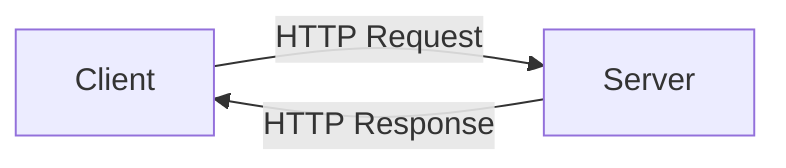

## Basic Architecture
- **Client**: Sends requests (e.g., web browsers, mobile apps)
- **Server**: Processes requests and sends responses
- **Protocol**: HTTP governs the rules of communication

## Historical Evolution

| Version | Status | Key Features |
|---------|---------|-------------|
| HTTP/0.9 | Obsolete | Basic protocol, HTML only |
| HTTP/1.0 | Obsolete | Added headers, methods, and status codes |
| HTTP/1.1 | Widely Used | Persistent connections, improved caching |
| HTTP/2 | Active | Multiplexing, server push, header compression |
| HTTP/3 | New | QUIC transport, improved performance |

## Data Transfer Capabilities
HTTP has evolved from simple HTML transfer to supporting various data formats:

- HTML (Hypertext Markup Language)
- XML (Extensible Markup Language)
- JSON (JavaScript Object Notation)
- Binary data
- Files and media

## Web Evolution Timeline
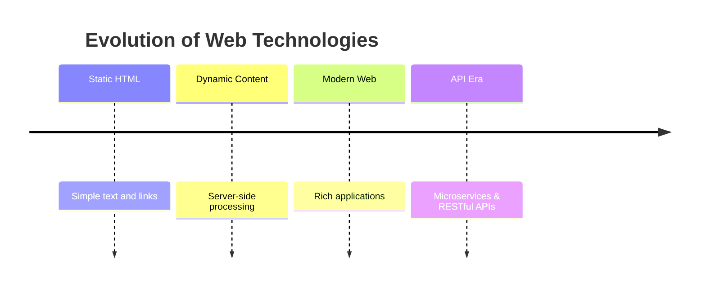

## Client-Server Communication Flow
1. Client initiates request
2. Server processes request
3. Server generates response
4. Client receives and processes response

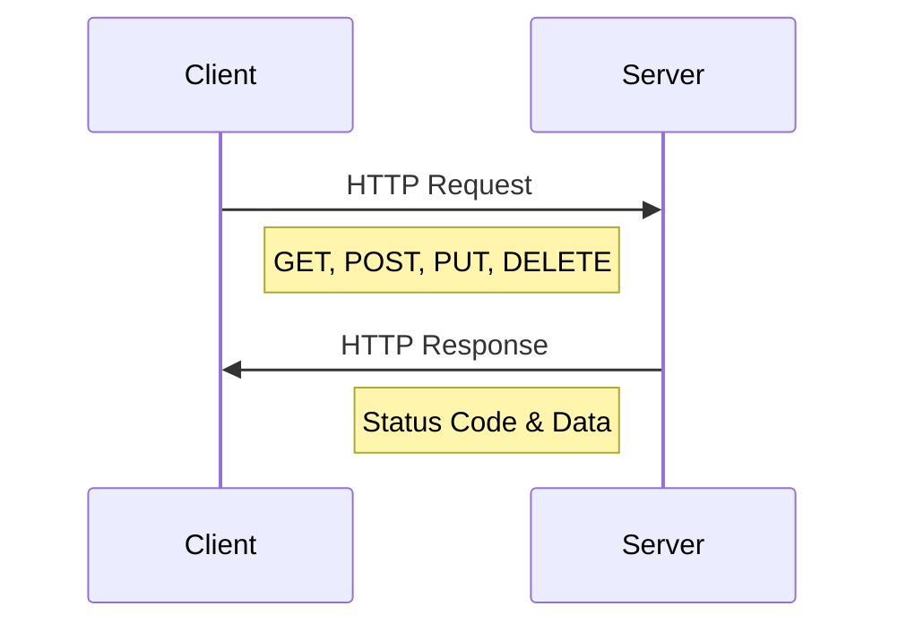

## Key Concepts
- **Stateless Protocol**: Each request-response cycle is independent
- **Request Methods**: GET, POST, PUT, DELETE, etc.
- **Status Codes**: Indicate request outcome (200 OK, 404 Not Found, etc.)
- **Headers**: Contain metadata about the request/response
- **Body**: Contains the actual data being transferred

## Modern Usage
- RESTful APIs
- Web Services
- Microservices Architecture
- Single Page Applications (SPAs)
- Progressive Web Apps (PWAs)

## Best Practices
1. Use appropriate HTTP methods
2. Implement proper error handling
3. Follow security guidelines
4. Optimize for performance
5. Consider caching strategies

---
*Note: HTTP/1.1 remains the most widely used version, though HTTP/2 and HTTP/3 offer significant improvements for modern web applications.*


# HTTP Protocol Characteristics

## 1. Stateless

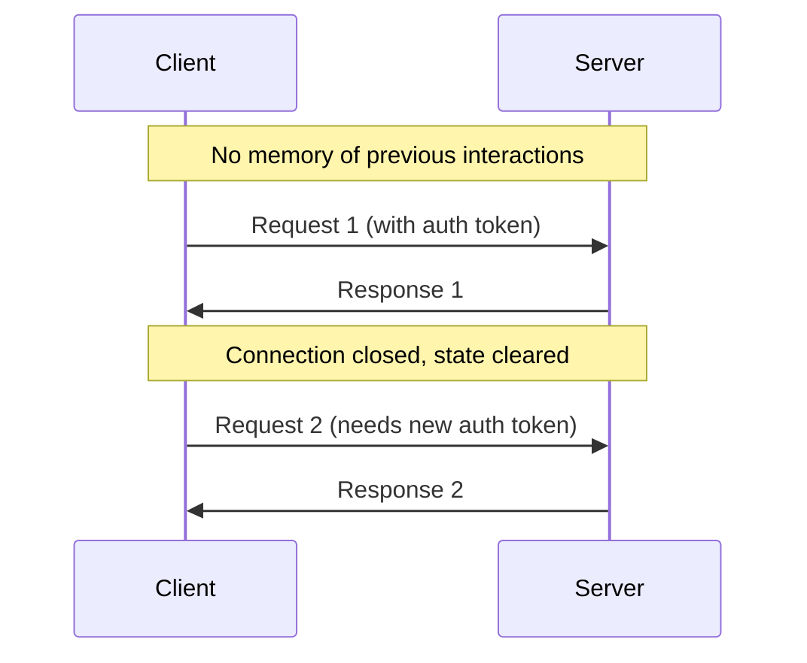

### Key Points
- Neither client nor server maintains memory of previous interactions
- Each request is treated as a completely new interaction
- Server doesn't remember previous requests from the same client

### Implications
- **Authentication Requirements**: 
  - Must send authentication tokens with each request
  - Session management typically handled through:
    - Cookies stored in browser
    - Authorization tokens in request headers
    - JWT tokens for API authentication

## 2. Connectionless

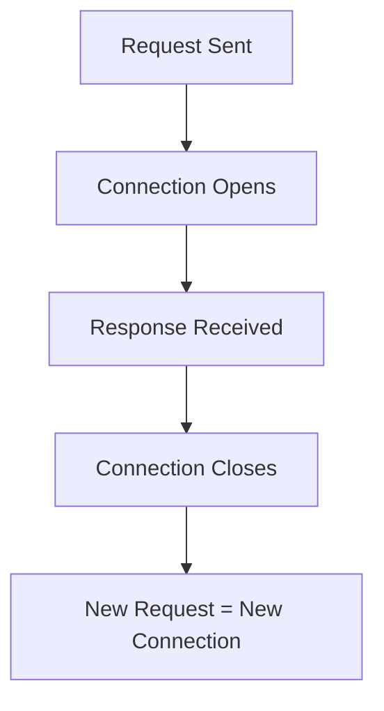

### Behavior
- Connection opens when request is sent
- Closes immediately after response is received
- Each new request requires a new connection
- No persistent connections between requests

### Process Flow
1. Client initiates request and opens connection
2. Server processes request
3. Server sends response
4. Connection automatically closes
5. Process repeats for each new request

## 3. Independent (Media Type Independence)

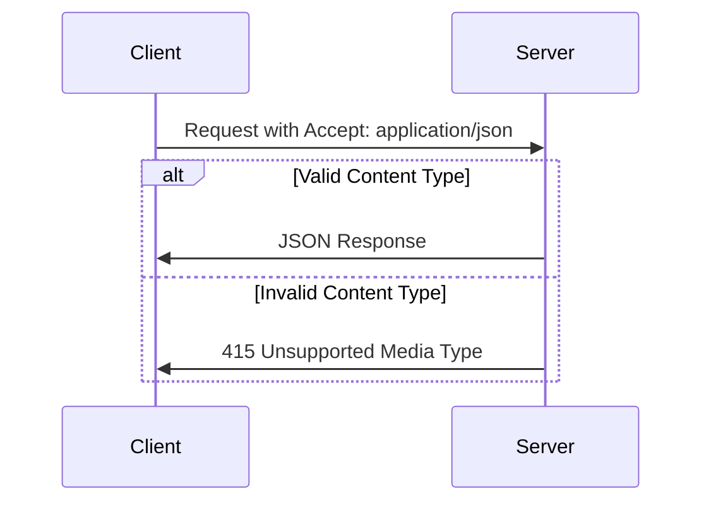

### Content Type Agreement
- Client and server must agree on data format
- Specified in HTTP headers:
  ```http
  Accept: application/json
  Content-Type: application/json
  ```

### Supported Types
- JSON
- XML
- HTML
- Plain text
- Binary data
- Custom media types

### Implementation Notes
- Server validates content type before processing
- Requests with mismatched content types are rejected
- Helps ensure data integrity and compatibility]

## 3. Data Type Independence

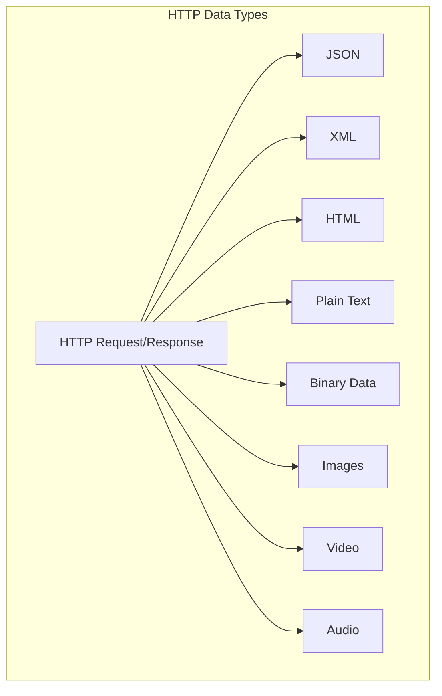

### Platform Independence
- HTTP supports multiple data formats
- Not restricted to any single data type
- Flexible communication between different platforms

### Supported Data Types
1. **Text-based Formats**
   - JSON (application/json)
   - XML (application/xml)
   - HTML (text/html)
   - Plain text (text/plain)

2. **Binary Formats**
   - Images (image/jpeg, image/png, etc.)
   - PDF (application/pdf)
   - Audio files
   - Video files

3. **Custom Formats**
   - Application-specific formats
   - Custom MIME types

### Implementation
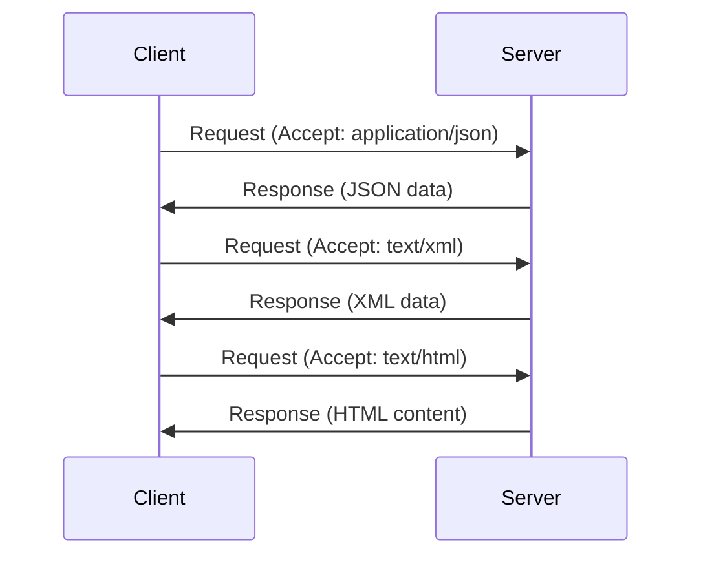

### Headers for Content Negotiation
```http
# Request headers
Accept: application/json, text/xml, text/html

# Response headers
Content-Type: application/json
```

## Best Practices

1. **Content Type Handling**
   - Support multiple data formats when possible
   - Clearly specify accepted formats in documentation
   - Implement proper content negotiation
   - Validate incoming data regardless of format

2. **Error Handling**
   - Return appropriate status codes
   - Provide error messages in requested format
   - Handle unsupported format requests gracefully

3. **Security Considerations**
   - Validate content types
   - Sanitize input for all supported formats
   - Implement proper content security policies

---
## Best Practices

1. **State Management**
   - Use secure token-based authentication
   - Implement proper session handling
   - Store necessary data in client-side storage

2. **Connection Handling**
   - Design for connectionless nature
   - Implement retry mechanisms
   - Use connection pooling when appropriate

3. **Content Type Handling**
   - Always specify content type in requests
   - Validate content types server-side
   - Handle unsupported media types gracefully

## Security Considerations

- Protect authentication tokens
- Implement HTTPS for secure communication
- Validate content types to prevent injection attacks
- Use appropriate security headers

---
*Note: Understanding these characteristics is crucial for building robust and secure web applications and APIs.*


# HTTP Request-Response Cycle

## Request Structure

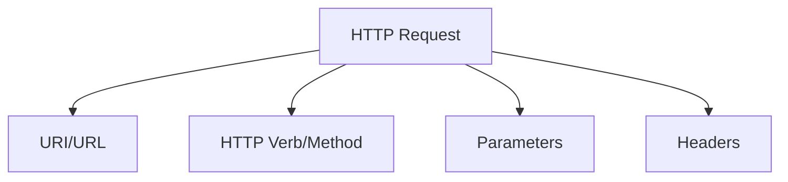

### 1. URI (Uniform Resource Identifier)
- Address of the resource on server
- Tells server which resource client wants to access
- Example: `https://api.company.com/employees/123`

### 2. HTTP Verbs/Methods
- Indicates type of action requested
- Common verbs:
  - GET: Retrieve data
  - POST: Create new resource
  - PUT: Update existing resource
  - DELETE: Remove resource

### 3. Parameters
Can be sent in different ways:
- Query parameters: `?id=123&name=john`
- Request body
- Path parameters: `/employees/123`

### 4. Headers
- Metadata about the request
- Examples:
  ```http
  Authorization: Bearer token123
  Content-Type: application/json
  Accept: application/json
  ```

## Server Processing

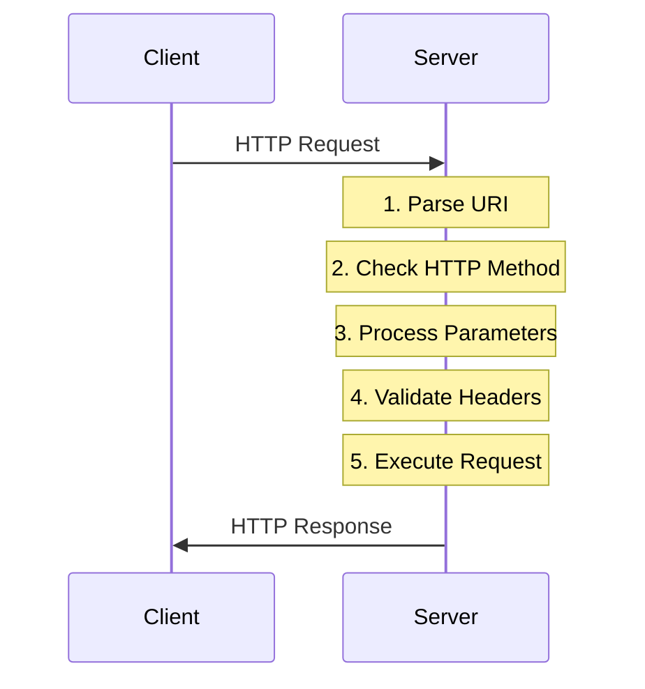

## Response Structure

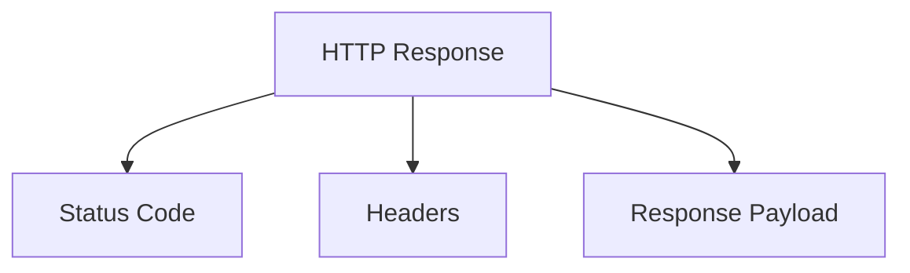

### 1. Status Codes
Indicates request outcome:
- 2xx Success
  - 200: OK
  - 201: Created
  - 204: No Content
- 3xx Redirection
  - 301: Moved Permanently
  - 302: Found
- 4xx Client Errors
  - 400: Bad Request
  - 401: Unauthorized
  - 404: Not Found
- 5xx Server Errors
  - 500: Internal Server Error
  - 503: Service Unavailable

### 2. Response Headers
- Metadata about the response
- Examples:
  ```http
  Content-Type: application/json
  Cache-Control: no-cache
  Content-Length: 234
  ```

### 3. Response Payload (Optional)
- Actual data being returned
- Must match agreed format
- Example JSON response:
  ```json
  {
    "employeeId": "123",
    "name": "John Doe",
    "department": "IT"
  }
  ```

## Complete Flow Example

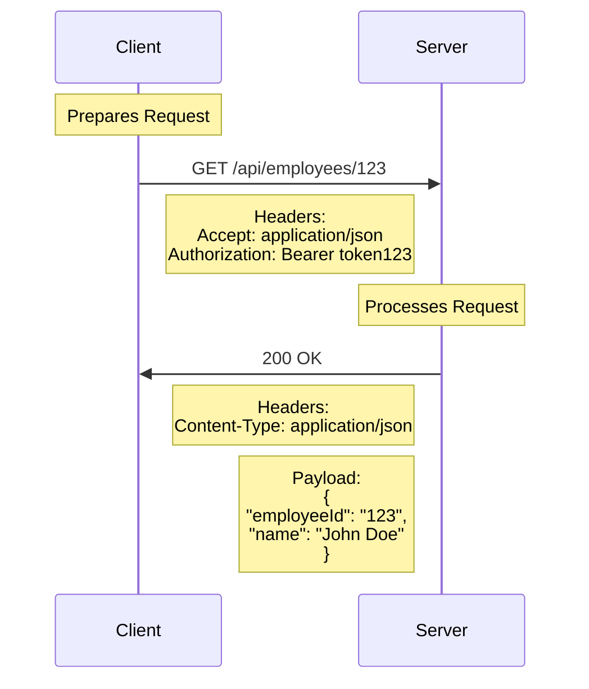

## Key Points
1. Every request must have:
   - URI
   - HTTP method
   - Headers

2. Response always includes:
   - Status code
   - Headers
   - Optional payload

3. Format Agreement:
   - Client specifies accepted format
   - Server responds in agreed format
   - Both must adhere to format specification

## Best Practices
1. Use appropriate HTTP methods
2. Include relevant headers
3. Handle status codes properly
4. Validate request/response format
5. Implement proper error handling

---
*Note: Understanding this request-response cycle is fundamental for building and debugging web applications and APIs.*
